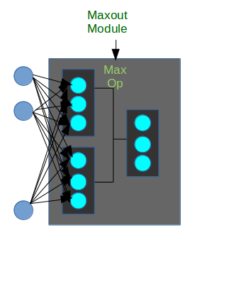

This is an attempt to replicate the following paper as the hyperparameter link is not working in the paper.

arXiv:1302.4389_ **[stat.ML]**

=======================
Dataset and Device Info
=======================

* **dataset**: `THE MNIST DATABASE`_
* **GPU**: 1, 8GB, *GM204GL [Tesla M60]*
* **CPU**: 4, 30.5 GiB
* **logs and model**: `here`_

The following diagram shows the maxout module with multilayer perceptrons.

=============
MLP + Dropout
=============

For complete hyperparameter tuning check ``hyper-tuning.rst`` file.

* Learning rate: 0.005

--------
Training
--------

+--------+------------+-------------------------+-------------------------+---------+--------+
|        |            |       Layer1            |       Layer2            |         |        |
| Epochs | Batch size +------------+------------+------------+------------+ Accuracy|  Loss  |
|        |            |  Number of |  Number of |  Number of |  Number of |   (%)   |        |
|        |            |   layers   |   Neurons  |   layers   |   Neurons  |         |        |
+========+============+============+============+============+============+=========+========+
|   5    |     64     |     4      |    2048    |     2      |     10     |  97.79  | 1.5060 |
+--------+------------+------------+------------+------------+------------+---------+--------+
|   5    |     64     |     4      |    1024    |     2      |     10     |  97.44  | 1.5107 |
+--------+------------+------------+------------+------------+------------+---------+--------+

----------
Validation
----------

+---------+------------+-------------------------+-------------------------+---------+--------+
|         |            |       Layer1            |       Layer2            |         |        |
|Training | Batch size +------------+------------+------------+------------+ Accuracy|  Loss  |
| Epochs  |            |  Number of |  Number of |  Number of |  Number of |   (%)   |        |
|         |            |   layers   |   Neurons  |   layers   |   Neurons  |         |        |
+=========+============+============+============+============+============+=========+========+
|    5    |     64     |     4      |    2048    |      2     |     10     |  96.94  | 1.5097 |
+---------+------------+------------+------------+------------+------------+---------+--------+
|    5    |     64     |     4      |    1024    |      2     |     10     |  96.83  | 1.5108 |
+---------+------------+------------+------------+------------+------------+---------+--------+

It has been trained further with whole training
dataset with the following accuracies and loss.

--------------------------------
Training with pretrained weights
--------------------------------

+--------+------------+-------------------------+-------------------------+---------+----------+
|        |            |       Layer1            |       Layer2            |         |          |
| Epochs | Batch size +------------+------------+------------+------------+ Accuracy|   Loss   |
|        |            |  Number of |  Number of |  Number of |  Number of |   (%)   |          |
|        |            |   layers   |   Neurons  |   layers   |   Neurons  |         |          |
+========+============+============+============+============+============+=========+==========+
|   5    |     64     |     4      |    2048    |     2      |     10     |**99.02**|**1.4827**|
+--------+------------+------------+------------+------------+------------+---------+----------+

-------
Testing
-------

+------------+-------------------------+-------------------------+---------+----------+
|            |       Layer1            |       Layer2            |         |          |
| Batch size +------------+------------+------------+------------+ Accuracy|    Loss  |
|            |  Number of |  Number of |  Number of |  Number of |   (%)   |          |
|            |   layers   |   Neurons  |   layers   |   Neurons  |         |          |
+============+============+============+============+============+=========+==========+
|     64     |     4      |    2048    |      2     |     10     |**97.17**|**1.5007**|
+------------+------------+------------+------------+------------+---------+----------+

============
3 Conv + MLP
============

The architecture presented in paper is as follows:
``conv -> maxpool -> conv -> maxpool -> conv -> maxpool -> MLP -> softmax``.
It is evident that the output of MLP is ``10`` and the input of MLP is whatever number comes from
``3rd maxpool``. Only I had to adjust was kernels, paddings of convolutional layers. Because those
are the only parameters in the network.

--------
Training
--------

+--------+-------+--------------+---------------+--------------+---------------+--------------+---------------+----------+---------+------+
|        |       |     Conv1    |    Maxpool1   |     Conv2    |    Maxpool2   |     Conv3    |    Maxpool3   |    MLP   |         |      |
| Epochs | Batch +--------+-----+------+--------+--------+-----+------+--------+--------+-----+------+--------+----+-----+  Acc %  | Loss |
|        |       | kernel | pad | pool | stride | kernel | pad | pool | stride | kernel | pad | pool | stride | in | out |         |      |
+========+=======+========+=====+======+========+========+=====+======+========+========+=====+======+========+====+=====+=========+======+
|   10   |   64  |  7 x 7 |  3  |2 x 2 |   1    | 5 x 5  |  2  |2 x 2 |   1    | 5 x 5  |  2  |2 x 2 |    1   |625 | 10  |**97.09**|1.4921|
+--------+-------+--------+-----+------+--------+--------+-----+------+--------+--------+-----+------+--------+----+-----+---------+------+
|   10   |   64  |  5 x 5 |  3  |2 x 2 |   1    | 5 x 5  |  2  |2 x 2 |   1    | 5 x 5  |  2  |2 x 2 |    1   |729 | 10  |  87.62  |1.5856|
+--------+-------+--------+-----+------+--------+--------+-----+------+--------+--------+-----+------+--------+----+-----+---------+------+
|   10   |   64  |  5 x 5 |  3  |2 x 2 |   1    | 3 x 3  |  2  |2 x 2 |   1    | 3 x 3  |  2  |2 x 2 |    1   |961 | 10  |  95.43  |1.5088|
+--------+-------+--------+-----+------+--------+--------+-----+------+--------+--------+-----+------+--------+----+-----+---------+------+
|   10   |   64  |  5 x 5 |  2  |2 x 2 |    1   | 3 x 3  |  2  |2 x 2 |    1   | 3 x 3  |  2  |2 x 2 |    1   |841 | 10  |  95.96  |1.5037|
+--------+-------+--------+-----+------+--------+--------+-----+------+--------+--------+-----+------+--------+----+-----+---------+------+

----------
Validation
----------

+-------+--------------+---------------+--------------+---------------+--------------+---------------+----------+---------+------+
|       |     Conv1    |    Maxpool1   |     Conv2    |    Maxpool2   |     Conv3    |    Maxpool3   |    MLP   |         |      |
| Batch +--------+-----+------+--------+--------+-----+------+--------+--------+-----+------+--------+----+-----+  Acc %  | Loss |
|       | kernel | pad | pool | stride | kernel | pad | pool | stride | kernel | pad | pool | stride | in | out |         |      |
+=======+========+=====+======+========+========+=====+======+========+========+=====+======+========+====+=====+=========+======+
|   64  |  7 x 7 |  3  |2 x 2 |    1   | 5 x 5  |  2  |2 x 2 |    1   | 5 x 5  |  2  |2 x 2 |    1   |625 | 10  |**96.85**|1.4928|
+-------+--------+-----+------+--------+--------+-----+------+--------+--------+-----+------+--------+----+-----+---------+------+
|   64  |  5 x 5 |  3  |2 x 2 |    1   | 5 x 5  |  2  |2 x 2 |    1   | 5 x 5  |  2  |2 x 2 |    1   |729 | 10  |  87.76  |1.5828|
+-------+--------+-----+------+--------+--------+-----+------+--------+--------+-----+------+--------+----+-----+---------+------+
|   64  |  5 x 5 |  3  |2 x 2 |    1   | 3 x 3  |  2  |2 x 2 |    1   | 3 x 3  |  2  |2 x 2 |    1   |961 | 10  |  95.16  |1.5828|
+-------+--------+-----+------+--------+--------+-----+------+--------+--------+-----+------+--------+----+-----+---------+------+
|   64  |  5 x 5 |  2  |2 x 2 |    1   | 3 x 3  |  2  |2 x 2 |    1   | 3 x 3  |  2  |2 x 2 |    1   |841 | 10  |  96.15  |1.5012|
+-------+--------+-----+------+--------+--------+-----+------+--------+--------+-----+------+--------+----+-----+---------+------+

---------------------
Training Continuation
---------------------

+--------+-------+--------------+---------------+--------------+---------------+--------------+---------------+----------+---------+------+
|        |       |     Conv1    |    Maxpool1   |     Conv2    |    Maxpool2   |     Conv3    |    Maxpool3   |    MLP   |         |      |
| Epochs | Batch +--------+-----+------+--------+--------+-----+------+--------+--------+-----+------+--------+----+-----+  Acc %  | Loss |
|        |       | kernel | pad | pool | stride | kernel | pad | pool | stride | kernel | pad | pool | stride | in | out |         |      |
+========+=======+========+=====+======+========+========+=====+======+========+========+=====+======+========+====+=====+=========+======+
|   10   |   64  |  7 x 7 |  3  |2 x 2 |    1   | 5 x 5  |  2  |  2   |    1   | 5 x 5  |  2  |  2   |    1   |625 | 10  |**97.58**|1.4874|
+--------+-------+--------+-----+------+--------+--------+-----+------+--------+--------+-----+------+--------+----+-----+---------+------+
|   10   |   64  |  5 x 5 |  3  |2 x 2 |    1   | 5 x 5  |  2  |  2   |    1   | 5 x 5  |  2  |  2   |    1   |729 | 10  |  88.04  |1.5811|
+--------+-------+--------+-----+------+--------+--------+-----+------+--------+--------+-----+------+--------+----+-----+---------+------+
|   10   |   64  |  5 x 5 |  3  |2 x 2 |    1   | 3 x 3  |  2  |  2   |    1   | 3 x 3  |  2  |  2   |    1   |961 | 10  |  96.25  |1.5011|
+--------+-------+--------+-----+------+--------+--------+-----+------+--------+--------+-----+------+--------+----+-----+---------+------+
|   10   |   64  |  5 x 5 |  2  |2 x 2 |    1   | 3 x 3  |  2  |  2   |    1   | 3 x 3  |  2  |  2   |    1   |841 | 10  |  96.75  |1.4960|
+--------+-------+--------+-----+------+--------+--------+-----+------+--------+--------+-----+------+--------+----+-----+---------+------+

-------
Testing
-------

+-------+--------------+---------------+--------------+---------------+--------------+---------------+----------+---------+------+
|       |     Conv1    |    Maxpool1   |     Conv2    |    Maxpool2   |     Conv3    |    Maxpool3   |    MLP   |         |      |
| Batch +--------+-----+------+--------+--------+-----+------+--------+--------+-----+------+--------+----+-----+  Acc %  | Loss |
|       | kernel | pad | pool | stride | kernel | pad | pool | stride | kernel | pad | pool | stride | in | out |         |      |
+=======+========+=====+======+========+========+=====+======+========+========+=====+======+========+====+=====+=========+======+
|   64  |  7 x 7 |  3  |2 x 2 |    1   | 5 x 5  |  2  |2 x 2 |    1   | 5 x 5  |  2  |2 x 2 |    1   |625 | 10  |**96.87**|1.4929|
+-------+--------+-----+------+--------+--------+-----+------+--------+--------+-----+------+--------+----+-----+---------+------+
|   64  |  5 x 5 |  3  |2 x 2 |    1   | 5 x 5  |  2  |2 x 2 |    1   | 5 x 5  |  2  |2 x 2 |    1   |729 | 10  |  87.39  |1.5861|
+-------+--------+-----+------+--------+--------+-----+------+--------+--------+-----+------+--------+----+-----+---------+------+
|   64  |  5 x 5 |  3  |2 x 2 |    1   | 3 x 3  |  2  |2 x 2 |    1   | 3 x 3  |  2  |2 x 2 |    1   |961 | 10  |  95.52  |1.5070|
+-------+--------+-----+------+--------+--------+-----+------+--------+--------+-----+------+--------+----+-----+---------+------+
|   64  |  5 x 5 |  2  |2 x 2 |    1   | 3 x 3  |  2  |2 x 2 |    1   | 3 x 3  |  2  |2 x 2 |    1   |841 | 10  |  96.30  |1.4989|
+-------+--------+-----+------+--------+--------+-----+------+--------+--------+-----+------+--------+----+-----+---------+------+

.. _arXiv:1302.4389: https://arxiv.org/abs/1302.4389
.. _The MNIST DATABASE: http://yann.lecun.com/exdb/mnist/
.. _here: https://drive.google.com/drive/folders/1YEIYEiIYuKoMn6p75xIra5B2t3MdUbJR
